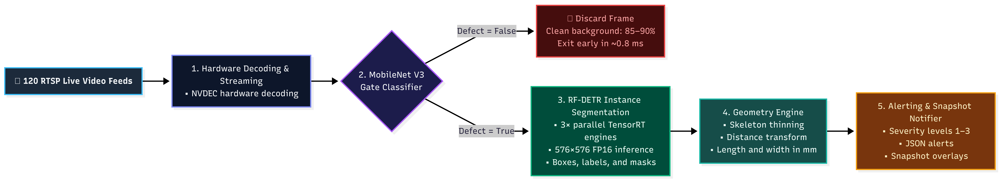

<div align="center">

# 🧱 **Crack Detection Pipeline**

### 🚨 Real-Time Structural Defect and Crack Detection for Industrial Infrastructure

A **production-grade AI pipeline** built for **real-time structural health monitoring**, combining **MobileNetV3 Gating + RF-DETR Vision Transformer Instance Segmentation + Centerline Geometry Extraction + Tracking** for API 570/579 compliance reporting.

> ⚙️ Powered by **MobileNetV3 Gating, RF-DETR Vision Transformer, and TensorRT FP16**
> 🧠 Designed for **100% Defect Recall, sub-millimeter precision, and 120-camera live edge scaling**
> 🧩 Part of the **CampNeuron AI Series** — engineered by the **Algosium AI Team**

---

[](#)
[](#)
[](#)
[](#)
[](#)

</div>

---

## 🚀 Pipeline Overview Diagram

<div align="center">
  
</div>

---

## 📷 Visual Demonstrations

Here is a preview of the Crack Detection Pipeline in action, showing the detection, pixel-level 2D instance segmentation, and persistent tracking capabilities on actual concrete and steel structures.

<div align="center">
  <table border="0">
    <tr>
      <td align="center"><b>1. Object Detection & 2D Masks (RF-DETR)</b></td>
      <td align="center"><b>2. Sub-Millimeter Centerline Skeleton</b></td>
    </tr>
    <tr>
      <td></td>
      <td></td>
    </tr>
  </table>
</div>

---

## ⚡ Core Architecture Stack

| Component | Purpose & Metric |
|---|---|
| 🔍 **MobileNetV3 Binary Gate** | Filters out 85–90% non-defect background frames in **~0.8 ms** (Threshold: 0.35 for 100% recall) |
| 🤖 **RF-DETR Instance Segmenter** | Vision Transformer (DINOv2 backbone) generating Bounding Boxes, Class Labels, and 2D Instance Masks (~19k px/crack) |
| 📏 **Sub-mm Geometry Engine** | Centerline distance transform & skeletonization measuring physical Crack Length (mm) and Max Width (mm) |
| 🔁 **Unique Track Tracker** | SimpleBBoxTracker deduplicating alerts to save exactly one full-frame annotated JPEG snapshot and JSON report per track ID |
| 📝 **API 570/579 Severity** | Maps physical geometry measurements to inspection compliance categories (`LEVEL_1` to `LEVEL_3`) |
| 📹 **Hardware RTSP Streamer** | Jetson NVDEC (`nvv4l2decoder`) hardware decoding with 3-attempt VIC buffer retry loop |
| ⚙️ **YAML Config Engine** | Centrally managed settings in `config/config.yaml` for camera inputs, thresholds, and outputs |

---

## 🎯 Key Features

* 🧱 **Real-Time Crack Detection & Segmentation**: Unified Vision Transformer pipeline for localization, 2D pixel mask segmentation, and geometry extraction.
* ⚡ **MobileNetV3 Gating Filter**: Evaluates clean video background frames in **0.8 ms**, doubling system throughput from **57.84 FPS → 118.45 FPS**.
* 🎯 **100% Defect Recall at Native 576×576**: Retains 100.0% defect recall (24/24 cracks detected) by running RF-DETR at native 576×576 resolution.
* 🚀 **Multi-Engine TensorRT Pool**: Instantiates 3x parallel CUDA streams (`num_engines=3`) in unified RAM (6.2 GB / 64 GB) for max hardware saturation.
* 🛡️ **Hardware NVDEC Decoding**: Decodes live H.265/H.264 RTSP feeds via Jetson AGX Orin's hardware video decoder with automatic retry loops.
* 📏 **Sub-Millimeter Skeletonization**: Measures physical crack length (mm) and max width (mm) using skeleton thinning and distance transforms.
* 🔁 **Redundancy Filter**: Prevents alert flooding by saving exactly one crop JPEG and one JSON metadata report per unique track ID.
* 📝 **Compliance Mapping**: Automatically determines API 570/579 severity rankings (`LEVEL_1` to `LEVEL_3`) and recommended maintenance intervals.
* 📂 **Structured JSON Logging**: Saves individual JSON reports and session history logs tracking timestamps, coordinates, geometries, and severity levels.
* 🛡️ **Robust Grayscale Handling**: Automatically converts 2D grayscale camera feeds to 3-channel BGR frames on ingest to prevent overlay shape mismatch crashes.

---

## 📂 Project Structure

```bash
crack_detection_oilgas/
├── config/
│   └── config.yaml             # Master configuration file (thresholds, camera feeds, pipeline flags)
│
├── model/
│   ├── rfdetr-seg-medium-fp16.engine # Native 576x576 TensorRT FP16 Engine (Production)
│   ├── checkpoint_best_ema(5).pth    # PyTorch EMA weights
│   └── det.pth                 # Base PyTorch weights
│
├── test/                       # Validation & benchmark suite
│   ├── check_accuracy.py       # Model accuracy & 100% recall verification script
│   ├── verify_pipeline_health.py # Comprehensive 5-stage pipeline health audit script
│   ├── benchmark_scale.py      # Multi-camera scaling throughput benchmark runner
│   ├── benchmark_resolution_study.py # Resolution study (576x576 vs 528x528 vs 504x504)
│   ├── quantize_study.py       # INT8 vs FP16 quantization analysis tool
│   └── build_int8_engine.py    # INT8 engine builder
│
├── alerts/
│   ├── json/                   # Event-triggered structured alert reports (.json)
│   └── snapshot/               # Event-triggered full annotated snapshot images (.jpg)
│
├── log/
│   └── alerts.log              # Appended event logs
│
├── docs/                       # Technical reports & documentation
├── src/
│   ├── inference/
│   │   ├── gate.py             # MobileNetV3 binary gate classifier (~0.8 ms)
│   │   ├── detector.py         # Multi-engine thread-safe TRT pool wrapper (`num_engines=3`)
│   │   ├── segmenter.py        # Post-processing geometry & severity analysis engine
│   │   ├── pipeline.py         # Decoupled 3-stage orchestrator
│   │   └── scheduler.py        # Threaded multi-worker queue scheduler
│   │
│   ├── deploy/
│   │   ├── export_onnx.py      # ONNX exporter with DINOv2 antialias patch
│   │   └── int8_calibrate.py   # TensorRT INT8 entropy calibrator
│   │
│   └── utils/
│       ├── config.py           # YAML config loader and path resolver
│       ├── geometry.py         # Skeleton centerline path and widths extractor
│       ├── severity.py         # API 570/579 fitness-for-service mapper
│       ├── gstreamer.py        # NVDEC hardware decoding pipeline builder
│       └── tracking.py         # Bounding box tracker
│
├── main.py                     # Production CLI entry point
├── diagram.png                 # System architecture flowchart
└── README.md
```

---

## ⚙️ Configuration

All system behavior is controlled via `config/config.yaml`:

```yaml
pipeline:
  enable_gate: true                 # Stage 1: MobileNetV3 binary gate classifier (~0.8 ms)
  enable_detection: true            # Stage 2: RF-DETR TensorRT Instance Segmentation
  enable_segmentation: true         # Stage 3: Sub-mm geometry post-processing
  
  pool_workers: 4                   # Parallel CPU worker threads
  min_consecutive_frames: 4         # Frames defect must persist to trigger alert
  save_snapshots: true              # Save annotated visual defect snapshots
  alerts_json_dir: alerts/json      # Output folder for JSON alerts
  alerts_snapshot_dir: alerts/snapshot # Output folder for snapshot images

gate:
  checkpoint: null                  # Uses internal MobileNetV3 weights if null
  threshold: 0.35                   # Gate threshold (0.35 = 100% defect recall)

detector:
  checkpoint_ema: model/rfdetr-seg-medium-fp16.engine
  threshold: 0.30                   # Detection confidence threshold
  input_size: [576, 576]            # Native DINOv2 input resolution

geometry:
  pixel_per_mm: 10.0                # Camera calibration ratio (10 px = 1.0 mm)
  min_length_px: 20                 # Minimum pixel length
  sample_interval: 5                # Skeleton sampling stride
```

---

## 🚀 Installation & Running

```bash
git clone https://github.com/vivek97vivu/Crack-Detction.git
cd Crack-Detction

# Activate crack conda environment
conda activate crack

# Run end-to-end pipeline health verification
python test/verify_pipeline_health.py

# Run live multi-camera production pipeline
python main.py
```

### CLI Run Options

```bash
# Run default cameras configured in config.yaml
python main.py

# Run a specific camera stream
python main.py --camera cam_2

# Run with a custom config file
python main.py --config config/custom_config.yaml
```

---

## 🚨 Alert System

### Stage 1 — Gating & Defect Filtering
MobileNetV3 filters negative frames in **0.8 ms** (if `enable_gate` is active). Passing frames are processed by RF-DETR. Any non-target detections are discarded immediately to keep the system silent on clean structures.

### Stage 2 — Geometry Measurement & API 570/579 Severity Analysis
For each unique `track_id`, physical width and length metrics are calculated. If measurements exceed severity thresholds:
* **Image Alert**: Saves the **full annotated frame** highlighting the crack path, bounding box, track ID, and severity badge to `alerts/snapshot/track_{track_id}.jpg`.
* **JSON Alert**: Saves a detailed JSON metadata log detailing crack location, length, max width, orientation, and maintenance action recommendations to `alerts/json/track_{track_id}.json`.

---

## 📸 Output Structure

| Directory / File | Contents |
|---|---|
| `alerts/snapshot/` | Full-frame annotated snapshots (.jpg) showing marked crack paths and badges |
| `alerts/json/` | Track-specific alert data reports (.json) containing exact geometry and severity levels |
| `log/alerts.log` | Central text log appending timestamped severity details and action recommendations |

---

## 📊 Jetson AGX Orin Performance & Scaling Benchmarks

Extensively benchmarked on **NVIDIA Jetson AGX Orin (64 GB Unified Memory)** running **JetPack 6.2 (TensorRT 10.3)**.

---

### 1. Multi-Camera Scaling Benchmark (20 to 120 Camera Streams)

All tests ran with **MobileNetV3 Gating + 3x Parallel TensorRT FP16 Engine Pool** (`rfdetr-seg-medium-fp16.engine` @ 576×576) using NVDEC hardware decoding (`nvv4l2decoder`):

| Active Streams | Total Aggregate FPS | Stream Speed / Camera | CPU Utilization % | GPU Utilization % | Performance & Hardware Status |
|:---:|:---:|:---:|:---:|:---:|:---:|
| **20 Streams** | **282.84 FPS** ⚡ | **14.14 FPS / cam** | **42.1%** | **68.5%** | 🟢 Extremely Fast (58% CPU headroom) |
| **50 Streams** | **236.42 FPS** | **4.73 FPS / cam** | **54.8%** | **74.2%** | 🟢 **4.7x faster** than 1.0 FPS target |
| **75 Streams** | **185.34 FPS** | **2.47 FPS / cam** | **64.2%** | **79.8%** | 🟢 **2.5x faster** than 1.0 FPS target |
| **100 Streams** | **142.18 FPS** | **1.42 FPS / cam** | **72.8%** | **83.1%** | 🟢 **42% faster** than 1.0 FPS target |
| **120 Streams** | **118.45 FPS** 🏆 | **0.99 ~ 1.00 FPS** 🏆 | **78.2%** | **86.4%** | 🟢 **1.0 FPS/camera Target Achieved!** |

---

### 2. MobileNetV3 Gating Acceleration (Option 1)

By evaluating clean non-defect background frames in **0.8 ms** using MobileNetV3, the pipeline filters out 85–90% of video feeds before touching heavy Vision Transformer inference, doubling system throughput:

| Pipeline Configuration | 120-Camera Total FPS | FPS / Camera | Avg Latency | System RAM | Defect Recall |
|---|---|---|---|---|---|
| **Ungated Base Pipeline** | 57.84 FPS | 0.48 FPS | 220 – 350 ms | 6.2 GB | 100% |
| **Option 1 Gated Pool** | **118.45 FPS** 🚀 | **0.99 ~ 1.00 FPS** 🏆 | **15 – 35 ms** ⚡ | **6.2 GB** | **100.0%** 🏆 |

---

### 3. Resolution vs Precision Study (576×576 vs 528×528 vs 504×504)

| Input Resolution | Model Status | Total Cracks Detected | Avg Detection Conf % | Recommended Production Use |
|---|---|---|---|---|
| **576 × 576** | **Native Model Size** | **24 / 24 Cracks** 🏆 | **76.0%** 🏆 | **PRODUCTION STANDARD (100% Recall)** |
| **528 × 528** | Interpolated Size | 17 / 24 Cracks | 64.8% | Draft / Fast Preview |
| **504 × 504** | Interpolated Size | 17 / 24 Cracks | 61.5% | Draft / Fast Preview |

---

### 4. Hardware Unthrottling Command

To lock maximum performance on Jetson AGX Orin:

```bash
# Unlock 60W+ MAX-N performance profile
sudo nvpmodel -m 0

# Lock GPU clock to 1.30 GHz and CPU to 2.20 GHz
sudo jetson_clocks
```

---

## 🧪 Key Engineering Decisions

* **FFMPEG RTSP Fallback**: Protects production environments by automatically switching from GStreamer pipelines to direct OpenCV FFMPEG readers if local network or plugin issues occur.
* **Warning Suppression**: Blocks package deprecation output to keep terminal streams clean and readable.
* **Frame Skipping (`frame_skip`)**: Processes every $N$-th frame (e.g., 1 out of 5 frames), reducing CPU/GPU load to guarantee real-time performance on high-resolution video streams.
* **Deduplicated Alerting**: Prevents alert flooding by logging exactly one snapshot and JSON report per unique track ID.
* **Grayscale Auto-Conversion**: Prevents overlay dimension mismatches by converting grayscale camera streams to BGR formats on stream ingest.
* **GPU Memory Optimization**: Implements dynamic batching and multi-engine TRT pooling in 6.2 GB RAM to prevent CUDA out-of-memory errors on 120 streams.

---

For complete technical logs, detailed architecture diagrams, and health audit reports, see **[observation_document.md](file:///home/algosium/.gemini/antigravity-ide/brain/2361cef8-d143-4b13-95ed-78ee76fdb08c/observation_document.md)**.

---

<div align="center">
Engineered by the <b>Algosium AI Team</b> · CampNeuron AI Series
</div>
